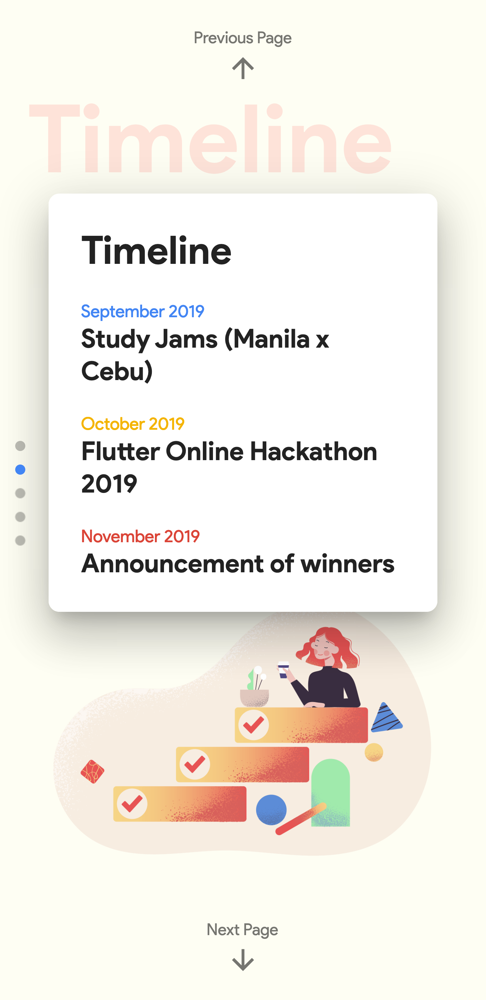
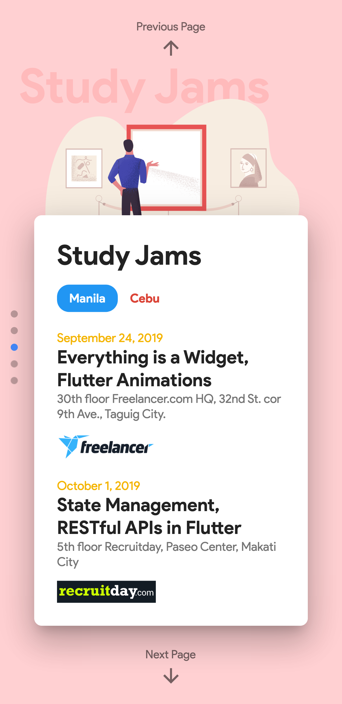
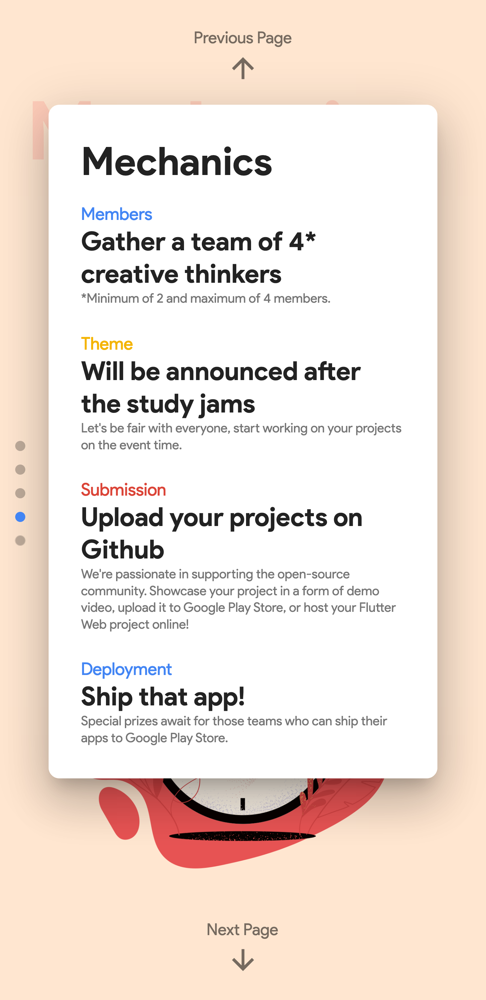
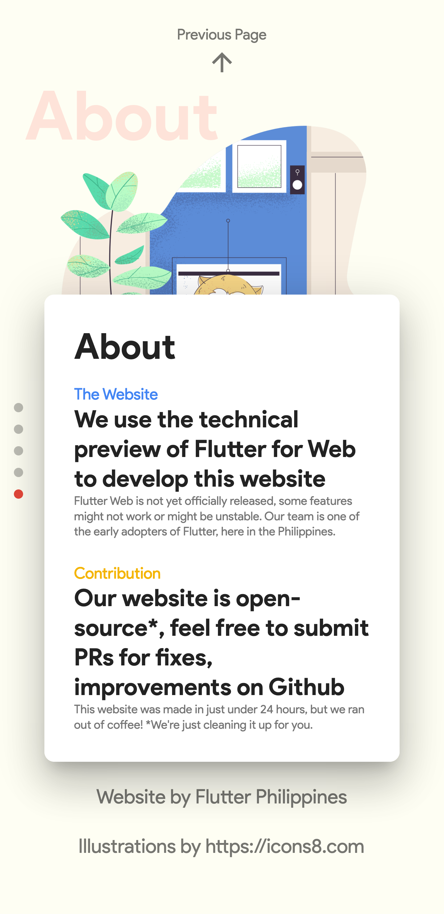

## Flutter Philippines Online Hackathon 2019

> These are the deployed build files of the [https://flutter.ph/hackathon2019](http://bit.ly/flutterph-hackathon2019-github). Flutter/Dart source code will be published soon.

### I. Event

#### Register

Registration link:
http://bit.ly/flutterph-hackathon-2019

#### Manila
* **September 24, 2019** - Study Jam #1: Everything is a Widget, Flutter Animations

* **October 1, 2019** - Study Jam #2: State Management, Material Design + Codelabs

#### Cebu

* **October 5, 2019** - Save Hours of Development Time Through Abstraction

* TBD

#### Hackathon

* **October 2019**

### II. Sponsors & Partners

 

 
 

 

 

 

 

Interested partnering with us for this event? Please reach us at [contact@flutter.ph](mailto:contact@flutter.ph) or fill up this [form](http://bit.ly/flutterph-hackathon2019-sponsors).

### III. The Website (Demo)

#### Mobile First Approach - Responsive Widgets Experiment

### IV. Screenshots

#### 1. Desktop

#### 2. Mobile

#### 3. Mobile Not Supported (Before)

### V. Support

Don't forget to hit that star button!

Feel free to follow us on our community groups, please visit:
https://flutter.ph
