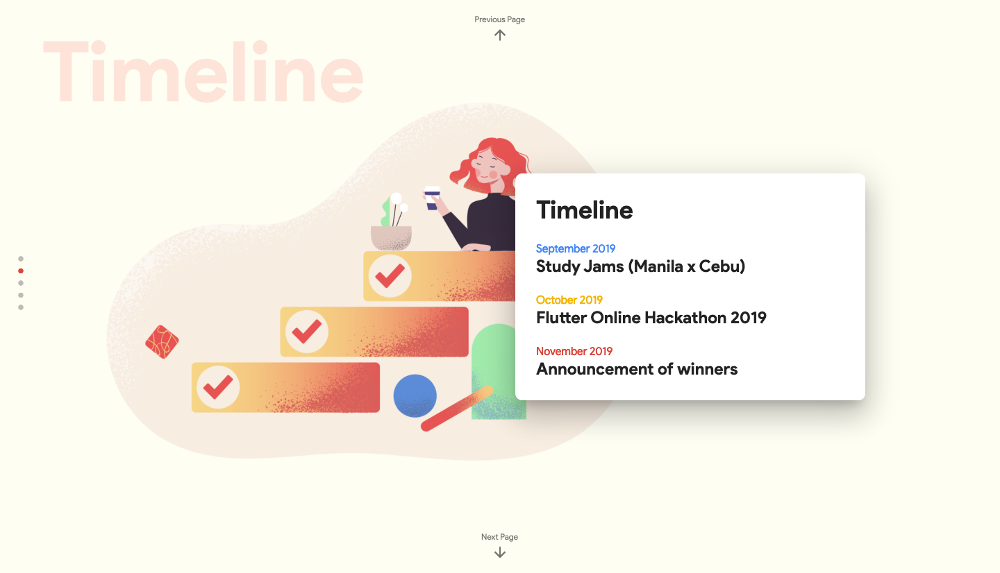

## Flutter Philippines Online Hackathon 2019

This is the deployed build files of the https://flutter.ph/hackathon2019. Flutter/Dart source code will be published soon.

### Event

#### Manila
* **September 24, 2019** - Study Jam #1: Everything is a Widget, Flutter Animations

* **October 1, 2019** - Study Jam #2: State Management, RESTful APIs in Flutter

#### Cebu

* TBD

* TBD

#### Hackathon

* **October 2019**

### Sponsors

Will be announced here soon!

Interested partnering with us for this event to help the community? Please send an email to [contact@flutter.ph](mailto:contact@flutter.ph).

### Screenshots

### Support

Don't forget to hit that like star!

Feel free to follow us on our community groups, please visit:
https://flutter.ph